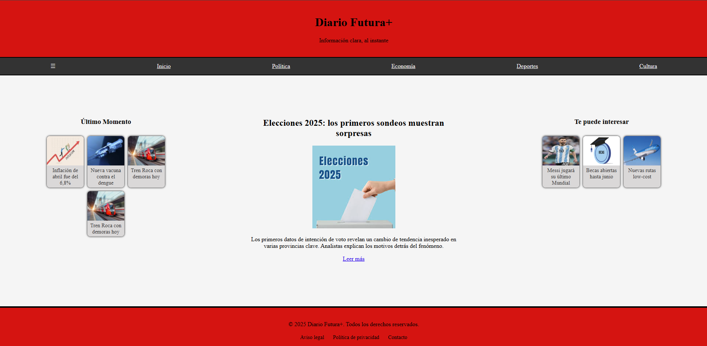

# Portada de Diario - TP2 - Flexbox

Este proyecto es una portada de diario digital responsiva desarrollada con HTML y CSS. Su diseño sigue un enfoque Mobile First, con una estructura clara y adaptable a distintos tamaños de pantalla.

## 📁 Estructura de Carpetas

/clase_6
├── index.html
├── css/
│ ├── normalize.css
│ └── style.css
├── img/
│ ├── inflacion.jpg
│ ├── vacuna.jpg
│ ├── tren.jpg
│ ├── elecciones.jpg
│ ├── messi.jpg
│ ├── becas.png
│ └── aerolineas.jpg

## 📄 Archivos

- **index.html**: Estructura principal del sitio con secciones semánticas (`header`, `main`, `footer`, `aside`, `article`, `nav`).
- **style.css**: Estilos personalizados que incluyen layout con `Flexbox`, diseño responsivo con `@media`, y una paleta de colores roja y gris.
- **normalize.css**: Archivo externo para normalizar estilos por defecto entre navegadores.

## 🧱 Componentes Destacados

- **Header** con nombre del diario y slogan.
- **Nav** superior con enlaces principales.
- **Aside izquierdo**: Últimas noticias con imágenes.
- **Main Article**: Titular destacado con imagen y resumen.
- **Aside derecho**: Noticias sugeridas.
- **Footer** con enlaces legales y derechos reservados.

## 💡 Tecnologías Usadas

- HTML5
- CSS3 (con Flexbox y Media Queries)
- Normalize.css v8.0.1

## 📱 Responsive Design

El sitio adapta su diseño según el ancho de pantalla:
- En dispositivos móviles: navegación vertical, bloques apilados.
- En pantallas grandes (a partir de 480px): navegación horizontal y disposición tipo grid con `aside`-`main`-`aside`.

## Vista previa

## 🚀 Cómo usarlo

1. Cloná o descargá el repositorio.
2. Abrí el archivo `index.html` en tu navegador.
3. Asegurate de tener los recursos (CSS e imágenes) en las rutas correctas.

## Repositorio
- https://github.com/ValenonG/garcia_daw_25

## Github Pages
- https://valenong.github.io/garcia_daw_25/clase_06/index.html